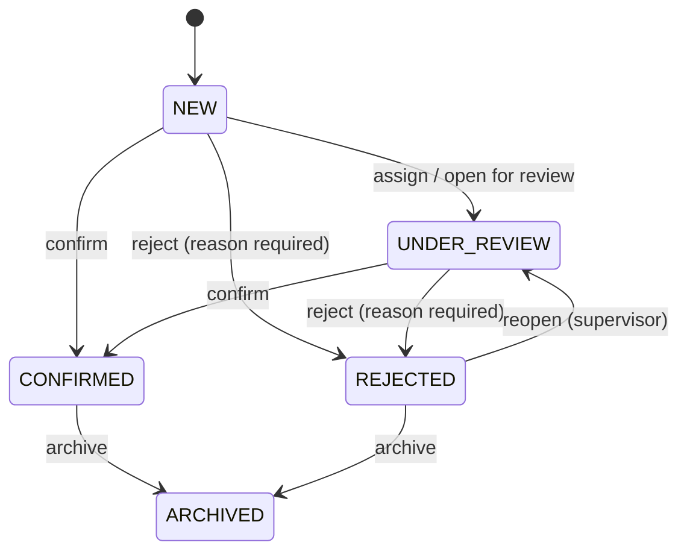

# SMART TRAFFIC — Database Design (PostgreSQL 16)

Conventions:

* PK: `id bigint GENERATED ALWAYS AS IDENTITY` unless noted. Public, human-readable codes are separate unique columns.
* All timestamps are `timestamptz` in UTC. `created_at` defaults to `now()`; `updated_at` is maintained by the ORM.
* Enums are PostgreSQL native enums (created and altered via Alembic).
* Constraint naming convention: `pk_%(table)s`, `fk_%(table)s_%(column)s_%(referred_table)s`, `uq_…`, `ix_…`, `ck_…`.
* Extensions: `pg_trgm` (fuzzy plate search). It is optional: the initial migration creates the extension and the two `*_plate_trgm` GIN indexes only when the server provides it (`pg_available_extensions`); otherwise plate search falls back to the B-tree unique index (prefix search).
* Confidence values (`ai_confidence`, `detection_confidence`, `plate_confidence`, thresholds) are stored as fractions `0..1` (`numeric(5,4)`, CHECK-constrained), and converted to percentages only for display.
* Soft delete (`deleted_at`) on `users` and `cameras` only, because audit and violations must keep referencing them.

---

## 1. ERD

```mermaid
erDiagram
    ROLES ||--o{ USERS : "has"
    ROLES ||--o{ ROLE_PERMISSIONS : "grants"
    PERMISSIONS ||--o{ ROLE_PERMISSIONS : "granted by"
    USERS ||--o{ USER_SESSIONS : "owns"
    USERS ||--o{ PASSWORD_RESET_TOKENS : "requests"
    USERS ||--o{ NOTIFICATIONS : "receives"
    USERS ||--o{ AUDIT_LOGS : "performs"
    USERS ||--o{ REPORTS : "creates"

    DISTRICTS ||--o{ LOCATIONS : "contains"
    LOCATIONS ||--o{ CAMERAS : "hosts"
    LOCATIONS ||--o{ TRAFFIC_LIGHTS : "hosts"
    AI_MODELS ||--o{ CAMERAS : "used by"

    CAMERAS ||--o{ CAMERA_CONNECTIONS : "connects via"
    CAMERAS ||--o{ CAMERA_HEALTH_LOGS : "reports"
    CAMERAS ||--o{ NETWORK_LOGS : "logs"
    CAMERA_CONNECTIONS ||--o{ NETWORK_LOGS : "logs"
    CAMERAS ||--o{ TRAFFIC_ZONES : "defines"
    CAMERAS ||--o{ TRAFFIC_LIGHTS : "observes"
    CAMERAS ||--o{ VEHICLE_DETECTIONS : "detects"
    CAMERAS ||--o{ VIOLATIONS : "records"
    CAMERAS ||--o{ AI_DETECTION_LOGS : "produces"
    AI_MODELS ||--o{ AI_DETECTION_LOGS : "produces"

    VEHICLE_TYPES ||--o{ VEHICLES : "classifies"
    VEHICLE_TYPES ||--o{ VEHICLE_DETECTIONS : "classifies"
    VEHICLES ||--o{ VEHICLE_DETECTIONS : "seen in"
    VEHICLES ||--o{ VIOLATIONS : "commits"

    VIOLATION_TYPES ||--o{ VIOLATIONS : "classifies"
    LOCATIONS ||--o{ VIOLATIONS : "at"
    TRAFFIC_ZONES ||--o{ VIOLATIONS : "triggered in"
    VEHICLE_DETECTIONS ||--o| VIOLATIONS : "source"
    VIOLATIONS ||--o{ VIOLATION_EVIDENCE : "proves"
    VIOLATIONS ||--o{ VIOLATION_EVENTS : "history"
    USERS ||--o{ VIOLATIONS : "assigned / reviewed"
    USERS ||--o{ VIOLATION_EVENTS : "acts"

    ROLES {
        bigint id PK
        varchar code UK "ADMINISTRATOR, SUPERVISOR, OPERATOR, ANALYST, VIEWER"
        varchar name
        text description
        bool is_system
    }
    PERMISSIONS {
        bigint id PK
        varchar code UK "violations.confirm"
        varchar module
        varchar name
    }
    ROLE_PERMISSIONS {
        bigint role_id PK,FK
        bigint permission_id PK,FK
    }
    USERS {
        bigint id PK
        varchar full_name
        varchar username UK
        varchar email UK
        varchar phone
        varchar password_hash
        bigint role_id FK
        varchar avatar
        enum status "ACTIVE, INACTIVE, BLOCKED"
        int failed_login_attempts
        timestamptz locked_until
        int token_version
        timestamptz last_login
        timestamptz deleted_at
    }
    USER_SESSIONS {
        uuid id PK
        bigint user_id FK
        uuid family_id
        varchar refresh_token_hash UK
        inet ip_address
        varchar user_agent
        timestamptz expires_at
        timestamptz revoked_at
    }
    PASSWORD_RESET_TOKENS {
        bigint id PK
        bigint user_id FK
        varchar token_hash UK
        timestamptz expires_at
        timestamptz used_at
    }
    DISTRICTS {
        bigint id PK
        varchar code UK
        varchar name
        numeric center_lat
        numeric center_lng
        jsonb boundary_geojson
    }
    LOCATIONS {
        bigint id PK
        bigint district_id FK
        varchar name "Yunusobod chorrahasi"
        varchar address
        enum location_type "INTERSECTION, STREET, HIGHWAY, PARKING"
        numeric latitude
        numeric longitude
    }
    CAMERAS {
        bigint id PK
        varchar code UK "CAM-001"
        varchar name
        bigint location_id FK
        enum camera_type "FIXED, PTZ, ANPR, SPEED"
        enum status "ONLINE, OFFLINE, WARNING, MAINTENANCE"
        bool is_enabled
        inet ip_address
        int port
        varchar mac_address
        varchar rtsp_url
        varchar username
        bytea password_encrypted
        varchar resolution
        int fps_target
        bool ai_enabled
        bool recording_enabled
        int retention_days
        numeric confidence_threshold
        bigint ai_model_id FK
        int speed_limit_kmh
        numeric road_direction_deg
        numeric latitude "mounting point, NULL = location"
        numeric longitude
        jsonb ai_config
        timestamptz last_heartbeat_at
        timestamptz deleted_at
    }
    CAMERA_CONNECTIONS {
        bigint id PK
        bigint camera_id FK
        enum connection_type "WIFI, LTE_4G, ETHERNET"
        bool is_primary
        varchar ssid_or_apn
        varchar operator
        enum status "CONNECTED, DEGRADED, DISCONNECTED"
        int signal_strength_dbm
        numeric bandwidth_mbps
        jsonb config
    }
    CAMERA_HEALTH_LOGS {
        bigint id PK
        bigint camera_id FK
        timestamptz recorded_at "partition key"
        enum status
        numeric fps
        int latency_ms
        numeric cpu_percent
        numeric temperature_c
        int signal_strength_dbm
        numeric packet_loss_pct
        bigint uptime_seconds
    }
    NETWORK_LOGS {
        bigint id PK
        bigint camera_id FK
        bigint connection_id FK
        timestamptz recorded_at
        enum network_type
        enum event "CONNECTED, DISCONNECTED, DEGRADED, RECOVERED, SWITCHED"
        int signal_strength_dbm
        int latency_ms
        numeric packet_loss_pct
        text message
    }
    TRAFFIC_ZONES {
        bigint id PK
        bigint camera_id FK
        varchar name
        enum zone_type "STOP_LINE, PARKING_RESTRICTED, LANE_DIRECTION, SPEED_TRAP, DETECTION_AREA"
        jsonb geometry "image-space points"
        jsonb config "allowed_duration_s, schedule, direction, distance_m, speed_limit"
        bool is_active
    }
    TRAFFIC_LIGHTS {
        bigint id PK
        varchar code UK
        bigint camera_id FK
        bigint location_id FK
        enum source "CONTROLLER, VISION, SIMULATED"
        jsonb roi
        varchar controller_url
        enum current_state "RED, YELLOW, GREEN, UNKNOWN"
        timestamptz state_changed_at
    }
    VEHICLE_TYPES {
        bigint id PK
        varchar code UK "CAR, TRUCK, BUS, MOTORCYCLE, OTHER"
        varchar name_uz
        varchar name_en
        varchar color
    }
    VEHICLES {
        bigint id PK
        varchar plate_number UK "normalised 01A123AA"
        varchar plate_display "01 A 123 AA"
        bigint vehicle_type_id FK
        varchar brand
        varchar model
        varchar color
        varchar vin
        varchar owner_name
        enum status "NORMAL, WATCHLIST, BLACKLIST"
        timestamptz first_seen_at
        timestamptz last_seen_at
        bigint last_camera_id FK
        int total_detections
        int total_violations
        varchar image_key
    }
    VEHICLE_DETECTIONS {
        bigint id PK
        timestamptz detected_at "partition key"
        bigint camera_id FK
        bigint vehicle_id FK
        varchar track_id
        bigint vehicle_type_id FK
        varchar plate_text
        numeric plate_confidence
        numeric detection_confidence
        jsonb bbox
        numeric speed_kmh
        numeric direction_deg
        varchar image_key
    }
    AI_MODELS {
        bigint id PK
        varchar name
        varchar version
        varchar framework "YOLOv8, YOLOX, ONNX"
        enum task "VEHICLE_DETECTION, PLATE_DETECTION, PLATE_OCR"
        varchar weights_uri
        numeric confidence_threshold
        numeric iou_threshold
        bool vehicle_detection
        bool plate_recognition
        bool speed_detection
        bool red_light_detection
        bool parking_detection
        bool wrong_direction_detection
        bool is_active
    }
    AI_DETECTION_LOGS {
        bigint id PK
        bigint camera_id FK
        bigint ai_model_id FK
        timestamptz window_start
        int window_seconds
        int frames_processed
        numeric avg_inference_ms
        int objects_detected
        int plates_read
        int violations_detected
        int errors
        jsonb payload
    }
    VIOLATION_TYPES {
        bigint id PK
        varchar code UK "RED_LIGHT, SPEEDING, ILLEGAL_PARKING, WRONG_DIRECTION, STOP_LINE"
        varchar name_uz
        varchar name_en
        enum severity "LOW, MEDIUM, HIGH, CRITICAL"
        numeric fine_amount
        varchar color
        jsonb rule_params
        bool is_active
    }
    VIOLATIONS {
        bigint id PK
        varchar code UK "VL-000124"
        bigint violation_type_id FK
        bigint camera_id FK
        bigint location_id FK
        bigint vehicle_id FK
        bigint vehicle_type_id FK
        bigint detection_id "soft ref (partitioned table)"
        bigint zone_id FK
        varchar plate_number
        varchar track_id
        enum status "NEW, UNDER_REVIEW, CONFIRMED, REJECTED, ARCHIVED"
        numeric ai_confidence
        numeric detected_speed
        numeric speed_limit
        numeric excess_speed
        varchar direction
        enum traffic_light_state
        timestamptz occurred_at
        bigint assigned_to FK
        bigint reviewed_by FK
        timestamptz reviewed_at
        text rejection_reason
        varchar idempotency_key UK
        jsonb metadata
    }
    VIOLATION_EVIDENCE {
        bigint id PK
        bigint violation_id FK
        enum evidence_type "IMAGE_MAIN, IMAGE_BEFORE, IMAGE_AFTER, VIDEO_CLIP, PLATE_CROP, VEHICLE_CROP, DETECTION_FRAME"
        varchar storage_backend
        varchar storage_key
        varchar mime_type
        bigint size_bytes
        int width
        int height
        numeric duration_s
        char sha256
        jsonb annotations "bboxes, labels, stop line"
        timestamptz captured_at
    }
    VIOLATION_EVENTS {
        bigint id PK
        bigint violation_id FK
        enum event_type "CREATED, STATUS_CHANGED, ASSIGNED, COMMENT, EXPORTED, REPORT_GENERATED"
        enum from_status
        enum to_status
        bigint actor_id FK "null = AI/system"
        text comment
        jsonb payload
        timestamptz created_at
    }
    NOTIFICATIONS {
        bigint id PK
        bigint user_id FK
        enum type "CRITICAL, WARNING, INFO, SYSTEM, VIOLATION"
        varchar category "CAMERA_OFFLINE, NEW_VIOLATION, AI_UNAVAILABLE, HIGH_TRAFFIC, SYSTEM_ERROR, REPORT_READY"
        varchar title
        text message
        varchar entity_type
        bigint entity_id
        varchar link
        enum state "UNREAD, READ, ARCHIVED"
        timestamptz read_at
        timestamptz created_at
    }
    REPORTS {
        bigint id PK
        enum report_type "DAILY, WEEKLY, MONTHLY, VIOLATION, CAMERA, VEHICLE, AI_PERFORMANCE, SYSTEM"
        enum format "PDF, XLSX, CSV"
        varchar title
        jsonb filters
        timestamptz date_from
        timestamptz date_to
        enum status "PENDING, PROCESSING, COMPLETED, FAILED"
        varchar storage_key
        bigint size_bytes
        text error_message
        varchar task_id
        bigint created_by FK
        timestamptz completed_at
    }
    AUDIT_LOGS {
        bigint id PK
        bigint user_id FK
        varchar action "USER_CREATED, VIOLATION_CONFIRMED, LOGIN_FAILED"
        varchar entity_type
        varchar entity_id
        inet ip_address
        varchar user_agent
        jsonb metadata "before/after diff"
        timestamptz created_at
    }
    SYSTEM_LOGS {
        bigint id PK
        enum level "DEBUG, INFO, WARNING, ERROR, CRITICAL"
        varchar source "backend, ai-service, celery, camera"
        varchar event_code
        text message
        jsonb context
        timestamptz created_at
    }
```

Supporting tables not drawn above: `system_settings` (key/value configuration) and the analytics
rollups `traffic_stats_hourly` and `violation_stats_hourly` (§3).

---

## 2. Table notes

### Identity and access
* **roles / permissions / role_permissions**: seeded from `app/seed/reference.py`. `is_system` roles cannot be deleted; their permissions can be edited.
* **users**: `username` and `email` are unique among non-deleted rows (`WHERE deleted_at IS NULL`). Incrementing `token_version` invalidates all existing access tokens (used on block, password reset, and role change).
* **user_sessions**: one row per refresh token. Rotation creates a new row in the same `family_id` and revokes the old one. Presenting a revoked token revokes the whole family. Login history = sessions + `LOGIN_*` audit rows.

### Geography
* **districts**: Tashkent districts (Yunusobod, Chilonzor, Mirzo Ulug‘bek, Yakkasaroy, Shayxontohur, Sergeli, Olmazor, Uchtepa, Bektemir, Mirobod, Yashnobod, Yangihayot). Boundaries are stored as GeoJSON.
* **locations**: named intersections and streets with coordinates. Cameras, traffic lights, and violations reference them, so analytics can group by location and district.

### Cameras and network
* **cameras.password_encrypted**: Fernet ciphertext using `CAMERA_SECRET_KEY`. Never serialised in API responses.
* **cameras.ai_config**: per-camera overrides (rule toggles, detect every k-th frame, classes). Effective config = `ai_models` defaults ⊕ camera overrides.
* **camera_connections**: supports multi-homed cameras (e.g. primary Wi-Fi with 4G fallback); `SWITCHED` network events record failover.
* **camera_health_logs**: sampled every 30 s plus every status change. Range-partitioned by month.

### Vehicles and detections
* **vehicles.plate_number**: normalised (uppercase, no spaces); `plate_display` is formatted for UI. Detections with an unreadable plate keep `vehicle_id = NULL`.
* **vehicle_detections**: one row per *track* (aggregated when the track ends), not per frame. Range-partitioned by month on `detected_at`. The PK is `(id, detected_at)` as partitioning requires.
* Counters (`total_detections`, `total_violations`, `last_seen_at`) are updated in the ingestion transaction.

### Violations
* **code**: generated from the sequence `violation_code_seq` → `VL-` + zero-padded 6+ digits.
* **detection_id**: plain `bigint` without a foreign key. `vehicle_detections` is partitioned with PK `(id, detected_at)`, so a single-column FK is impossible; the link is resolved in the service layer and may dangle after detection partitions are dropped by retention.
* **idempotency_key**: `camera_code:track_id:rule_code:occurred_at_bucket`, so an AI retry from the outbox never creates duplicates.
* **Status machine** (enforced in `violation_service`):

* **violation_evidence**: immutable after insert (no UPDATE path in the API). Deletion happens only through the retention job and is logged.
* **violation_events**: append-only timeline. Comments are events with `event_type = COMMENT`.

### Notifications, reports, logs
* **notifications**: one row per recipient. Recipients are resolved by permission (e.g. `violations.review` for NEW_VIOLATION, `settings.view` for CAMERA_OFFLINE). Large fan-outs run in Celery.
* **reports**: generated asynchronously; the file lives in storage under `reports/…`. History is kept indefinitely; files follow the retention setting.
* **audit_logs**: append-only. The DB role for the app has no UPDATE/DELETE grant on this table in production.
* **system_logs**: application-level operational events (WARNING and above, plus important INFO events). Debug output goes to stdout only.

### Settings
* **system_settings** (`key varchar PK, value jsonb, description, updated_by, updated_at`): heartbeat timeout, warning thresholds, retention defaults, demo mode flags, notification routing, map defaults.

---

## 3. Analytics rollups

| Table | Grain | Columns | Filled by |
|---|---|---|---|
| `traffic_stats_hourly` | camera × hour × vehicle_type | `vehicle_count, avg_speed_kmh, max_speed_kmh` | Celery `rollups.hourly` + incremental upsert on ingest |
| `violation_stats_hourly` | camera × hour × violation_type × status | `count, avg_confidence` | Celery `rollups.hourly` (recomputes the last 2 h to absorb late status changes) |
| `camera_availability_daily` | camera × day | `online_seconds, offline_seconds, warning_seconds, avg_fps, avg_latency_ms` | Celery nightly |

Dashboard and analytics read rollups for ranges > 24 h and raw tables (indexed) for "today".

---

## 4. Indexes

| Table | Index | Purpose |
|---|---|---|
| users | `uq_users_username_active (username) WHERE deleted_at IS NULL`, same for email; `ix_users_role_id` | login, admin list |
| user_sessions | `ix_user_sessions_user_id`, `uq_refresh_token_hash` | refresh, logout-all |
| cameras | `uq_cameras_code`, `ix_cameras_status`, `ix_cameras_location_id` | lists, map, watchdog |
| camera_health_logs | `(camera_id, recorded_at DESC)` per partition | charts, last status |
| network_logs | `(camera_id, recorded_at DESC)` | network tab |
| vehicles | `uq_vehicles_plate_number`; GIN `gin_trgm_ops` on `plate_number`; `(status)`; `(last_seen_at DESC)` | plate search, blacklist |
| vehicle_detections | `(camera_id, detected_at DESC)`, `(vehicle_id, detected_at DESC)`, BRIN `(detected_at)` | history, camera stats |
| violations | `(status, occurred_at DESC)`, `(camera_id, occurred_at DESC)`, `(violation_type_id, occurred_at DESC)`, `(location_id, occurred_at DESC)`, `(vehicle_id, occurred_at DESC)`, `(assigned_to, status)`, GIN trgm on `plate_number`, `uq_idempotency_key` | every violation filter combination used by the UI |
| violation_evidence | `(violation_id)` | details page |
| violation_events | `(violation_id, created_at)` | timeline |
| notifications | `(user_id, state, created_at DESC)` | bell badge, inbox |
| reports | `(created_by, created_at DESC)`, `(status)` | history |
| audit_logs | `(created_at DESC)`, `(user_id, created_at DESC)`, `(entity_type, entity_id)`, `(action, created_at DESC)` | audit filters |
| system_logs | `(level, created_at DESC)`, `(source, created_at DESC)` | log viewer |
| ai_detection_logs | `(camera_id, window_start DESC)` | AI performance |

## 5. Partitioning and retention

* Monthly range partitions (UTC month boundaries) for `vehicle_detections` and `camera_health_logs`, named `<table>_yYYYYmMM`. The initial migration creates the previous, current and next two months plus a `<table>_default` partition, and installs `ensure_monthly_partition(parent regclass, month date)`, which is idempotent. A Celery task calls it to keep 3 months ahead. Rows must not accumulate in the default partition, because a new monthly partition cannot be attached while the default holds rows for that range.
* Ids of partitioned tables come from dedicated sequences (`camera_health_logs_id_seq`, `vehicle_detections_id_seq`) owned by the parent table.
* Old partitions are detached and dropped according to `system_settings.retention.*`.
* Evidence files are removed after `cameras.retention_days`, **except** for violations in `CONFIRMED` status (kept for the legal retention period setting).

## 6. Seed data (`scripts/seed_database.py`, idempotent)

| Data | Content |
|---|---|
| Roles + permissions | 5 roles, 21 permissions, default matrix (below) |
| Users | `admin` (ADMINISTRATOR); with `--demo` also `supervisor`, `operator`, `analyst`, `viewer`. Passwords come from `SEED_ADMIN_PASSWORD` / `SEED_DEMO_PASSWORD`. Outside production a random password is generated and printed once; in production a missing password aborts the seed. |
| Districts / locations | 12 Tashkent districts, ~30 real intersections with coordinates |
| Cameras | 45 cameras (`CAM-001…CAM-045`) across locations with Wi-Fi/4G/Ethernet connections, zones, and traffic lights |
| Types | vehicle types (5), violation types (5 core + LANE_VIOLATION, NO_SEATBELT reserved and inactive) |
| AI models | `yolov8n-vehicles 1.0` (active), `uz-lpr 1.0` |
| Demo history (`--demo`, refused in production) | Deterministic (`--seed`): ~2,000 vehicles, 30 days of violations (~5.5k) with rush-hour/weekday profile and review timelines, camera statuses, 7 days of hourly health samples, notifications. Skipped when vehicles already exist. Evidence files are produced later by the AI simulator through the real ingest API, not by the seed. |

### Default permission matrix

| Permission | ADMIN | SUPERVISOR | OPERATOR | ANALYST | VIEWER |
|---|:-:|:-:|:-:|:-:|:-:|
| dashboard.view, monitoring.view, cameras.view, violations.view, vehicles.view | ✓ | ✓ | ✓ | ✓ | ✓ |
| cameras.create, cameras.update, cameras.delete | ✓ | update only | | | |
| violations.review | ✓ | ✓ | ✓ | | |
| violations.confirm, violations.reject | ✓ | ✓ | ✓ | | |
| analytics.view | ✓ | ✓ | | ✓ | ✓ |
| reports.view | ✓ | ✓ | ✓ | ✓ | ✓ |
| reports.create | ✓ | ✓ | | ✓ | |
| users.view | ✓ | ✓ | | | |
| users.create, users.update, users.delete | ✓ | | | | |
| settings.view | ✓ | ✓ | | | |
| settings.update | ✓ | | | | |
| system_logs.view | ✓ | ✓ | | | |
