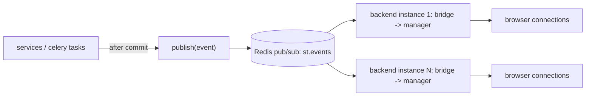

# SMART TRAFFIC — WebSocket Specification

Endpoint: `wss://<host>/api/v1/ws` (proxied by nginx with `Upgrade`; idle timeout 75 s).

## 1. Transport architecture



* Events are published **only after the DB transaction commits**.
* Each instance filters by channel subscription **and** by the connection's permissions before sending.
* Per-connection send queue (max 500). A slow client gets the oldest *droppable* events (`vehicle.detected`, `camera.heartbeat`) dropped first; it is disconnected with code 4008 if critical events would also be dropped.

## 2. Handshake and client messages

1. Client connects (no token in the URL, so tokens never land in proxy logs).
2. Within 5 s the client sends `{"action":"auth","token":"<access JWT>"}`.
3. Server replies `{"type":"auth.ok","data":{"user_id":7,"permissions":[…],"server_time":"…"}}`, or closes with **4001** (invalid) / **4003** (forbidden) / **4401** (expired; the client refreshes and reconnects).
4. Before the access token expires, the client sends a new `auth` message on the same socket (re-auth without reconnecting).

| Action | Payload | Effect |
|---|---|---|
| `auth` | `{token}` | Authenticate / re-authenticate |
| `subscribe` | `{channels: ["dashboard","cameras","camera:CAM-001","violations","system"]}` | Join channels (permission-checked) |
| `unsubscribe` | `{channels: […]}` | Leave channels |
| `ping` | `{}` | Server answers `pong`. The client pings every 25 s; the server closes after 60 s of silence. |

`notifications:{user_id}` is joined automatically after auth.

## 3. Server envelope

```json
{
  "id": "01J9Z6Q1X8F4…",
  "type": "violation.created",
  "channel": "violations",
  "ts": "2026-10-06T09:23:41.512Z",
  "data": { }
}
```

`id` is a ULID (sortable). The client keeps the last 200 ids for de-duplication.

## 4. Channels

| Channel | Required permission | Contents |
|---|---|---|
| `dashboard` | dashboard.view | KPI deltas, system status |
| `cameras` | cameras.view | Status changes and heartbeats for all cameras (heartbeats throttled to 1 per camera per 5 s) |
| `camera:{code}` | monitoring.view | High-frequency per-camera detections (only while a viewer has that camera open) |
| `violations` | violations.view | Created and updated violations |
| `system` | settings.view | System alerts, service status |
| `notifications:{user_id}` | self | Personal notifications |
| `reports:{user_id}` | self | Report progress |

## 5. Event catalogue

### `camera.status_changed` — channels `cameras`, `dashboard`

```json
{ "camera_id": 1, "code": "CAM-001", "name": "Yunusobod chorrahasi",
  "from": "ONLINE", "to": "OFFLINE", "reason": "HEARTBEAT_TIMEOUT",
  "last_heartbeat_at": "2026-10-06T09:22:58Z" }
```

### `camera.heartbeat` — channel `cameras` (throttled, droppable)

```json
{ "camera_id": 1, "code": "CAM-001", "status": "ONLINE", "fps": 24.8, "latency_ms": 42,
  "cpu_percent": 37.5, "temperature_c": 51.2, "signal_dbm": -61, "packet_loss_pct": 0.3,
  "network_type": "WIFI", "vehicle_count": 12, "ai_status": "RUNNING" }
```

### `vehicle.detected` — channel `camera:{code}` (≤ 2/s per camera, droppable)

```json
{ "camera_code": "CAM-001", "frame_ts": "…",
  "counts": { "CAR": 9, "TRUCK": 1, "BUS": 1, "MOTORCYCLE": 1 },
  "objects": [ { "track_id": "t-482", "class": "CAR", "conf": 0.93,
                 "bbox": [0.31, 0.52, 0.42, 0.68], "plate": "01A123AA", "speed_kmh": 47 } ] }
```

Bounding boxes are normalised `[x1, y1, x2, y2]` in 0..1. The MJPEG stream already has boxes burned in; this event drives counters and side panels.

### `violation.created` — channels `violations`, `dashboard`

```json
{ "id": 124, "code": "VL-000124", "type": { "code": "RED_LIGHT", "name": "Qizil chiroqda o‘tish", "severity": "HIGH" },
  "camera": { "id": 1, "code": "CAM-001" }, "location": { "id": 3, "name": "Yunusobod" },
  "plate_number": "01 A 123 AA", "vehicle_type": "CAR", "ai_confidence": 95.7,
  "occurred_at": "2026-10-06T09:23:41Z", "status": "NEW",
  "thumbnail_url": "/api/v1/files/…?exp=…&sig=…" }
```

The UI shows the live alert (NEW VIOLATION · type · camera · plate · time · confidence) with **View / Open violation / Dismiss**.

### `violation.updated` — channel `violations`

```json
{ "id": 124, "code": "VL-000124", "from": "NEW", "to": "CONFIRMED",
  "actor": { "id": 7, "full_name": "Azizbek" }, "assigned_to": null, "updated_at": "…" }
```

### `notification.created` — channel `notifications:{user_id}`

```json
{ "id": 9912, "type": "CRITICAL", "category": "CAMERA_OFFLINE",
  "title": "Kamera oflayn", "message": "CAM-006 (Sergeli) 30 soniyadan beri javob bermayapti",
  "link": "/cameras/6", "created_at": "…", "unread_count": 5 }
```

### `system.alert` — channels `system`, `dashboard`

```json
{ "level": "CRITICAL", "code": "AI_SERVICE_UNAVAILABLE", "message": "AI xizmati javob bermayapti",
  "source": "backend", "context": { "since": "…" } }
```

Codes: `AI_SERVICE_UNAVAILABLE`, `AI_SERVICE_RECOVERED`, `DB_DEGRADED`, `REDIS_DEGRADED`, `HIGH_TRAFFIC`,
`STORAGE_LOW`, `OUTBOX_BACKLOG`, `SECURITY_TOKEN_REUSE`.

### `dashboard.updated` — channel `dashboard` (coalesced, at most 1 per 2 s)

```json
{ "kpis": { "total_vehicles": 124580, "active_cameras": 42, "offline_cameras": 3,
            "today_violations": 1284, "confirmed": 947, "pending": 287, "rejected": 50, "uptime_pct": 99.7 },
  "changed": ["today_violations", "pending"] }
```

### `report.updated` — channel `reports:{user_id}`

```json
{ "id": 55, "status": "COMPLETED", "progress": 100, "download_url": "/api/v1/reports/55/download" }
```

## 6. Client behaviour (frontend `services/ws.ts`)

* States: `connecting → authenticating → open → reconnecting → closed`, exposed in `realtime.store` and shown in the topbar.
* Reconnect with exponential backoff: 1 s, 2 s, 4 s … capped at 30 s, ±20 % jitter. Reset after 60 s of stable connection.
* On (re)connect: re-auth, re-subscribe to active channels, then invalidate TanStack queries for the visible page (resync anything missed).
* Close code 4401 → call `/auth/refresh` once, then reconnect. A second failure → logout and redirect to `/login`.
* Event hooks: `useWsEvent('violation.created', handler)`, with channel subscriptions managed by reference counting per mounted component.

## 7. Close codes

| Code | Meaning |
|---|---|
| 1000 | Normal |
| 4001 | Auth failed / no auth within 5 s |
| 4003 | Forbidden channel |
| 4008 | Client too slow (queue overflow) |
| 4401 | Access token expired |
| 4429 | Too many connections for the user (limit 10) |
